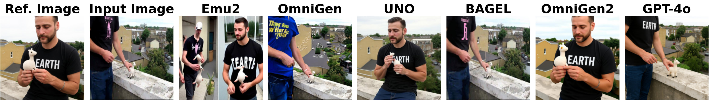
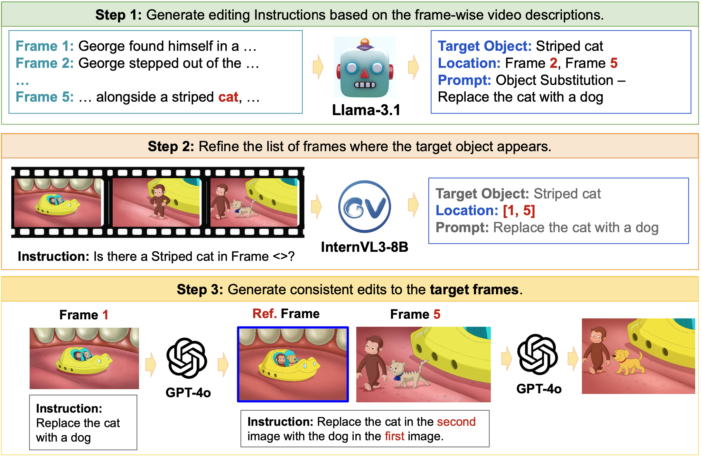
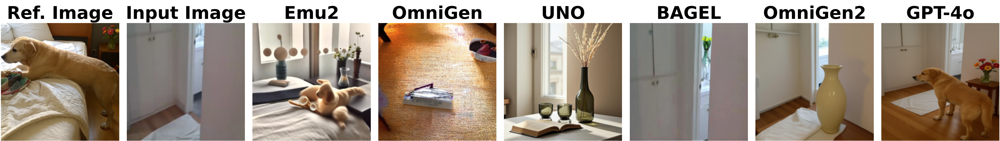

# SpotEdit

## *Evaluating Visually-Guided Image Editing Methods* 


<p align="center"> 
<a href="https://github.com/SaraGhazanfari/SpotEdit"></a> 
<a href=""></a>
<a href="https://huggingface.co/datasets/saraghznfri/SpotEditBench"></a>
</p>

We introduce SpotEdit, a benchmark designed to evaluate the visually guided image-editing capabilities of state-of-the-art open- and closed-source models.


<p float="center">
   
  
</p>

Our benchmark is constructed from both real and synthetic video frames, capturing the same objects across variations in pose, orientation, and scale. Using our automated data-generation pipeline, each benchmark sample consists of:

- a reference image,
- an input image,
- an instruction, and
- a near ground-truth edited image.

<p float="center">
  
</p>

In addition, SpotEdit includes a dedicated section for evaluating hallucinations, where either the reference or input image does not contain the object specified in the instruction. 
Qualitative examples illustrate that current models frequently introduce hallucinations during the editing process:

<p float="center">
   
  
</p>

For a detailed quantitative analysis, please refer to the paper.
<a name="ack"></a>
### Acknowledgements

This work leverages the code and model from:
- [InternVL](https://github.com/OpenGVLab/InternVL)
- [Emu2](https://github.com/dmsc/emu2)
- [OmniGen](https://github.com/VectorSpaceLab/OmniGen)
- [UNO](https://github.com/bytedance/UNO)
- [BAGEL](https://github.com/ByteDance-Seed/Bagel)
- [OmniGen2](https://github.com/VectorSpaceLab/OmniGen2)

We sincerely thank the authors for releasing their models and code, which greatly support progress in this field.

<a name="bibtex"></a>
### Citation
If you use our code or models, please consider citing our work using the following BibTex entry:
```bibtex
```
